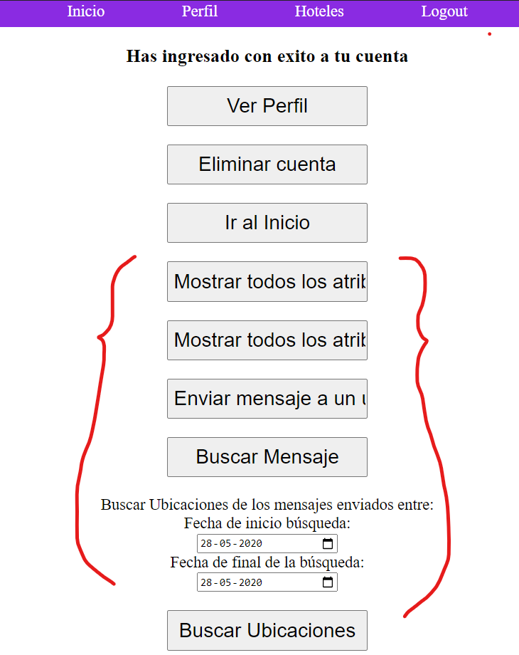
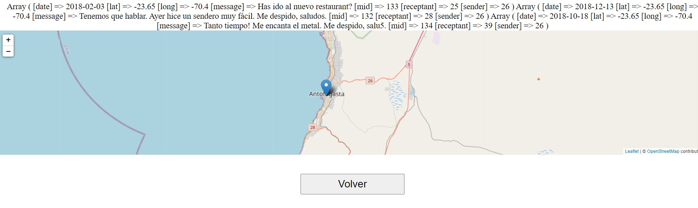

# Entrega 5: grupo 30 y grupo 53

## Ruta de la api

La ruta específica la API a la cual realizamos consultas es **e5db.herokuapp.com**.

## Funcionalidades Solicitadas

Para encontrar el origen de las nuevas funciones en nuestra pagina web primero debes iniciar sesion con una cuenta. Si lo haces correctamente la pagina te redijirá a multiples opciones para seleccionar, aqui las últimas 5 opciones corresponde a las funciones solicitadas. (En terminos de código esto ocurre en ```Sites/consultas/consulta_verificar_datos.php```)

Deberias ver algo como lo siguiente:



Las opciones marcadas corresponden las nuevas funciones.

### Funcion 1:

Esta funcion muestra al usuario que ingresó, todos los mensajes que ha recibido junto con los datos del mismo. El código en cuestión se encuentra en el archivo ```consulta_uno_api.php```.

### Funcion 2:

Esta función permite al usuario que inició sesión ver todos los mensajes que el usuario a enviado a otras personas con toda la información en cuestión. El código se puede encintrar en el archivo ```consulta_dos_api.php```

### Funcion 3: 

Con esta función el usuario puede enviar mensajes a otros usuarios. Primero se ingresa a ```consulta_tres_api.php```, donde se ingresan los datos necesarios para enciar el mensaje, este es, el nombre del destinatario y el mensaje en cuestion, para luego ingresar a ```consulta_tres_api_2.php```, donde el mensaje es enviado y registrado en la base de datos. El mensaje se envia si todos los campos son llenado correctamente, en caso contrario enviará un mensaje. 

### Funcion 4: 

Busca los mensajes que el ususuario quiera, indicando lo que este pueda o no contener. Para esto se le piden los mismo datos que pide text-search para buscar el mensaje. El código está implementado en ```consulta_cuatro_api.php```, el cual pide estos datos de búsqueda, para luego pasar a ```consulta_cuatro_api_2.php```, el cual genera la coneccioón con la api. 

### Funcion 5: Mostrar ubicaciones de los mensajes 

Esta funcion muestras las ubicaciones desde las cuales se enviaron los mensajes entre las fechas seleccionadas. En términos de código debes revisar ```Sites/consultas/consulta_cinco_api.php``` para analizar su funcionalidad. 
Ej: Si utilizas el usuario BrianDuke (contraseña: 1234), entre los años 2018 y 2020, deberias ver algo como:





## Markdown

Este documento está escrito en Markdown. Es un **lenguaje de marcación**, como *LaTeX*. Como notarás, es bastante simple y GitHub sabe interpretarlo. Markdown es utilizado tanto en **Issues** como **Wikis**, por lo que siempre que estés en GitHub puedes contar con que puedes usarlo. Puedes utilizar [esta guía de referencia](https://github.com/adam-p/markdown-here/wiki/Markdown-Cheatsheet) para aprender a utilizar Markdown. También existen editores online como [dillinger.io](http://dillinger.io/) o [stackedit.io](https://stackedit.io).
